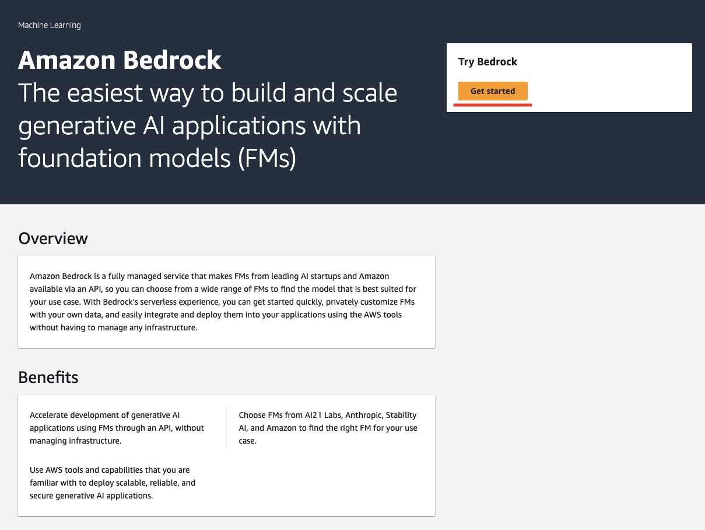
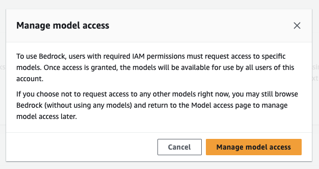
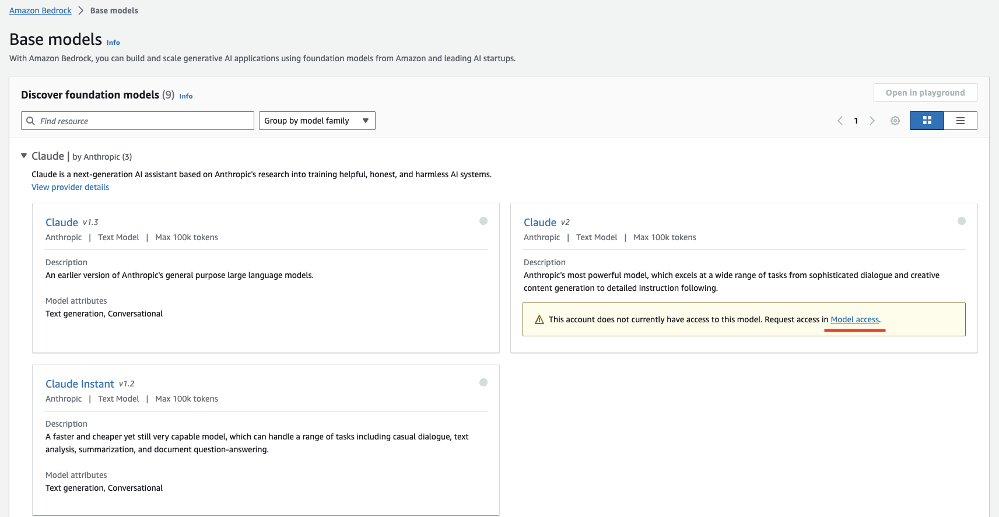
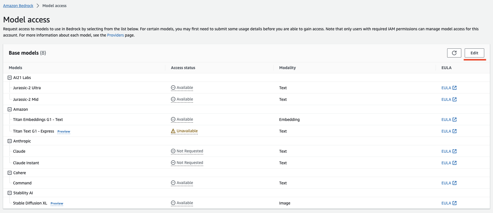
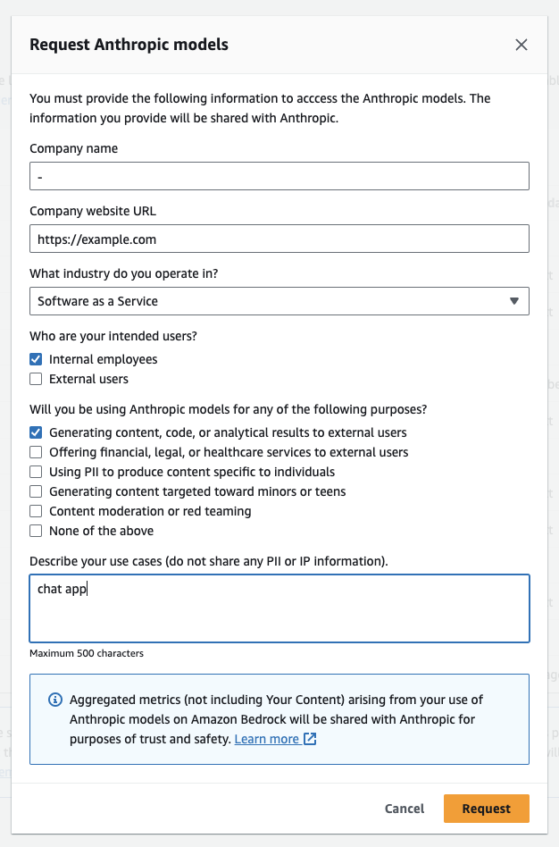
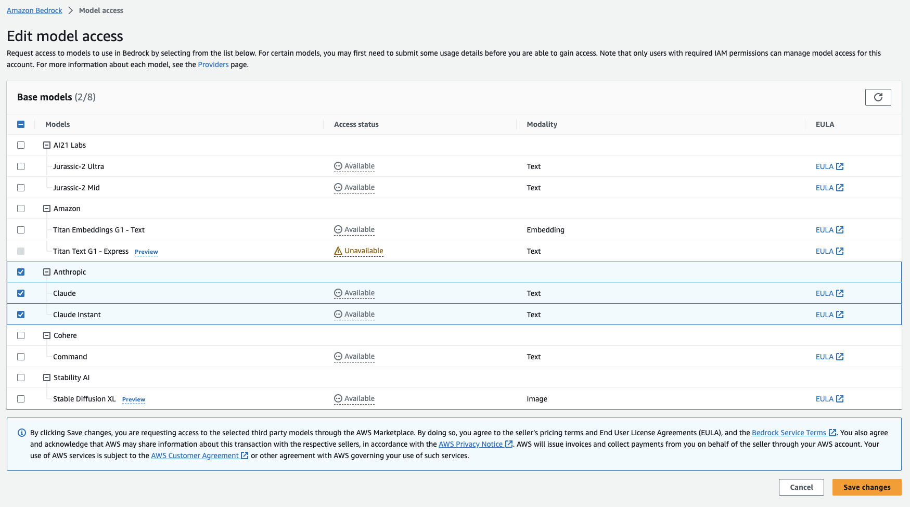
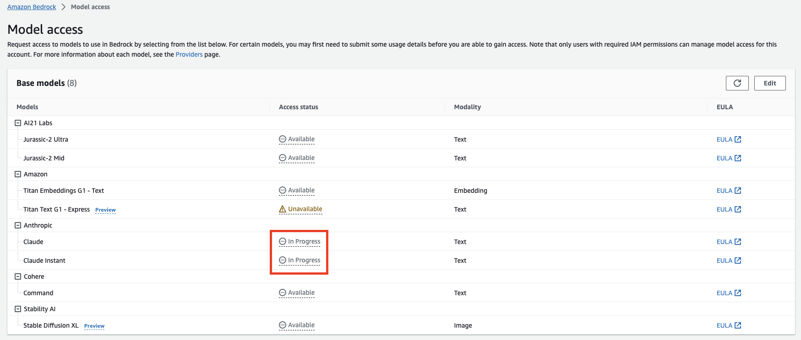
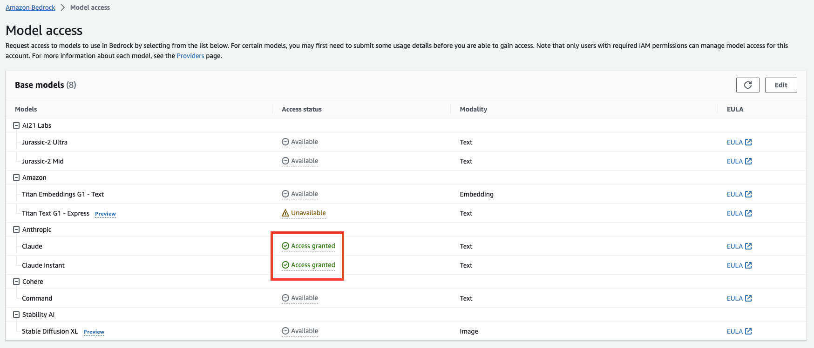

# Amazon Bedrock Model access リクエスト手順

1. Amazon Bedrockにアクセスし、「Get Started」をクリックしてください。  
※ この時リージョンが us-east-1（バージニア北部）であることを確認してください。

2. 「manage model access」 をクリックします。

3. claude v2 のパネルにカーソルを合わせ、「model access」をクリックします。

4. 画面右上の「Edit」をクリックします。

5. Antropic の横のEditをクリックすると画像のような入力フォームが表示されますので、必要事項を入力してRequestをクリックしてください。

※ Anthropic の Access Status が Not Requested の場合のみ必要です。

6. Anthropic にチェックを入れて、Save change をクリックします。

7. Save 後、Access Status が In Progress になっていることを確認します。

8. 数時間時間を空けて、再度アクセスしてください。Access Status が Access Granted になっていることが確認できれば申請完了です。

